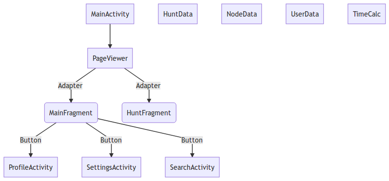
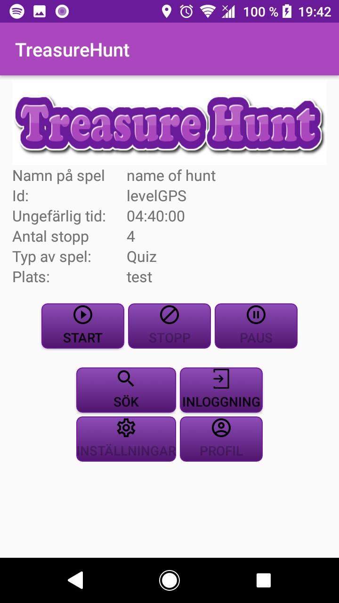
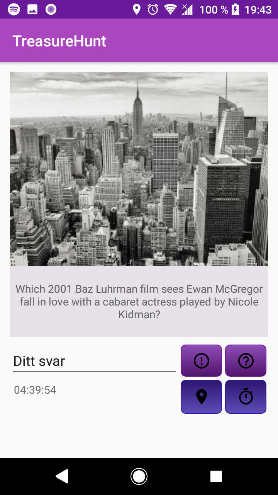
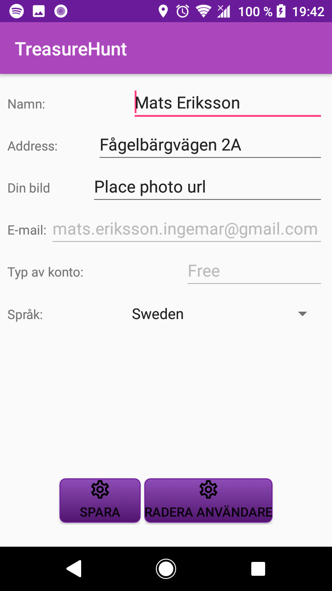

# Treasure Hunt

## Description
The main idea for this Android application is a normal quiz walk. However, there
should be the alternative to make the run as a scavenger hunt. This mean the user does not know
where the next point of interest is, but the answer should give you that info.
This type of game is referred to as "Hunt" in the rest of the documentation.
A normal quiz walk is referred as "Quiz".

Each play consist of several points of interest, so called nodes, which will create
a path. The user should have the possibility to search for a game at a certain location and
which type of game he/she want to play.

The position of the player is detected by GPS. Depending of which game has been selected
the user will be provided with new info when the application detects the next node.
- For a quiz game this mean the user will be provided with a new question/riddle, that
has to be answered to give the next node information.
- For a hunt game this will also be a new question/riddle, but the answer will be the location of next node. For example; a question could be "This tower was finished 1967 and is 155 m high. This tower was in the beginning used as link for radio and TV broadcasts.". The user then have to find the way to the Kaknästornet (which is the answer). The application will give the user feedback with a distance in a cycle time (ex every 20-30s).  

To make the game more fun a timer is introduced. The timer will count down when the game start.
Each wrong answer should remove some time (Quiz). When the time is at zero the game is finished and
user should have the possibility to continue but with 0 score. The score is basically the time.

The interface of the game should be as flexible as possible. Several options could apply to
the game to make it more exciting. For example are,
- Timer goes upwards --> Raise. Score should be as less as possible. This could be mixed with
with Hunt and Quiz (Raise Hunt, Raise Quiz).
- One hunt/quiz can unlock hidden games.
- The user could grade or place a comment on each hunt.

It should be noted that even if the the application has a high quality and design, the
result is very depending on the quality of the hunt/quiz. The user expect that the application
is working and is focusing on the game. So the overall experience from the user, will
probably be about the hunt/quiz and not the application.  

## Links
[Competitive analyze](/docs/competitive_analyze/competitive_analyze.pdf) <br>
[PM](/docs/pm/teknisk.pdf) <br>
[Screencast application](https://youtu.be/T0tQ3bbFh4U) <br>
[Screencast software](https://youtu.be/2C1A-MHYvAo)
[Screencast software](https://liuonline-my.sharepoint.com/:v:/r/personal/mater307_student_liu_se/Documents/vokoscreen-2019-01-06_18-42-49.mkv?csf=1&e=9H9M2X)

## Specifications
Here is the complete list of specifications that was made in the beginning of the project. Later a
competitive analyze was made which show other area should have been prioritized. For more
information, please read the competitive analyze in the folder `docs`.

### Must have criteria
- *Images:* The interface could provide an image for each node. This can give some extra support
for the player. It is also possible that the image is the question.
- *Time:* A timer will start when the hunt/quiz begin. Each wrong answer will remove X amount of time from the ongoing time (actually a counter). Score is depending on time.
- *Hint:* If the player is stuck it could ask for extra help. Each node can give three hints. But X amount of time will be removed from the ongoing time.  
- *Settings:* The user can change or adjust language, country etc.
- *Language:* It should be possible to select a language or the application should detect which location the phone has and choose accordingly.
- *Search:* The user can search for a hunt/quiz by country, location and type.
- *Firebase:* The application will download the path from a server. Also data about the user will be stored on the server.
- *Authentication:* The user can login and data about the user will be stored in Firebase.
The user can check its data in a profile activity.
- *Profile:* Contain all data regarding the user. How many games are done etc. Data in this activity can't be changed.

### Good-to-have criteria
- *Flip-screen layout:* When the device is flipped or turned 90 degree a new layout
will resize the screen according to the new format.
- *Google-map:* The user has access to a Google-map which could be used to track
or show next point of interest in ongoing game.
- *Save to a local storage:* The user can save the hunt/quiz walk to local storage
which could be reload/replayed later on. This will reduce the amount of network
service.
- *Run without Internet:* The user can run the application without Internet. This
can't be done without saving the path locally (please see criteria above).
- *Highscore:* Each game has a highscore list.
- *Create path:* The user can make there own game. This would preferable be done on a webpage or an interface
which is bigger then a mobile. Probably the user would need to search for question/answers on the Internet.
- *Check other players profile:* To increase interest for the application the user can show-Off
its profile for outer players.

## Build status
Treasure hunt is developed and compiled in software version SDK-28, with the option to minimum version SDK-24. For more information please see the gradle files.
Plugin 'com.google.gms.google-services' is used and has to be installed into *Android Software* folder.
Up today following permission are required to be inserted in the manifest.xml.
This could change in future versions of the game.
```java
<uses-permission android:name="android.permission.ACCESS_FINE_LOCATION"/>
<uses-permission android:name="android.permission.INTERNET"/>
```

## Structure
Right now the following classes are used. The structure can change at anytime, no warranty ensure.



## Code style
Because this project is mainly in Android the easiest code style is to follow
what *Android Studio* is representing by default. Because Android Studio
automatically does some of the changes when inserting files/images etc. It's
very convenient to follow the same style. An abbreviated list of some of the
style topics.
- Interface names must start with an `I`, followed by an `UpperCamelCase` name.
- For function names and return variables use `lowerCamelCase`.
- Struct or union field names is `lowerCamelCase`.
- Enum values should be `UPPER_CASE_WITH_UNDERSCORES`.
- Class names are capitalized and camel-case.
- Constants are capitalized.
- Comments can be done by `//` or `/** */`

```java
// Single line comment
/** This is documentation comment */
```
Please use `//` for trailing comments, none documentation comments and TODO.

- *Formatting*:
    - Line length should be around 80 columns long.
    - No trailing whitespaces.
    - Spaces vs. tabs. Use only spaces  :frowning:  (Android Studio goes crazy otherwise)
    - Indent size. Use 4 spaces for blocks and 8 spaces for line wraps.
- For logging purposes, each class should have a `private static final TAG string`.

*Features which are outside of Android Code style implementation*
- Function argument has start with a underscore.
- Local variables in classes start with a lowercase m.

[Android Code Style Guide](https://source.android.com/devices/architecture/hidl/code-style)

### Gitflow
This project has GitFlow installed and will follow this criteria. This mean that
brances 'develop', 'release', 'master', 'hotfix' will be pre-installed into the
repository. Work will be done on feature branches and merged into develop
branch.
More to read at.. <br>
[GitFlow cheatsheet](https://danielkummer.github.io/git-flow-cheatsheet/) <br>
[Workflow of GitFlow](https://www.atlassian.com/git/tutorials/comparing-workflows/gitflow-workflow)

## Screenshots





## Installations
Open a terminal and place your self in the folder which will hold the project.
Copy the git-address from the repository and write `$ git clone [ADDRESS]`. <br>

[SSH address to repository](git@gitlab.ida.liu.se:mater307/TDP028.git) <br>
[HTTPS address to repository](https://gitlab.ida.liu.se/mater307/TDP028.git)

Before working on the repository, make sure following software packages are installed.
*SDK platforms*
- Android 8.0 (Oreo) API level 26
- Android 7.0 (Nougat) API level 24
*SDK tools*
- Google Play Services

The build gradle script need following dependencies:
- 'com.google.firebase:firebase-database:11.8.0'
- 'com.google.firebase:firebase-auth:11.8.0'
- 'com.google.android.gms:play-services:11.8.0'
- 'com.google.android.gms:play-services-location:11.8.0'
and apply 'com.google.gms.google-services' as a plugin.
This changes should already be applied in the repository.

## API Reference
This project is using many API and the most important are location and firebase.
Also google-sign in is used, however OAuth 2.0 is not used. All users are stored
in firebase. This Android application support several languages (at version 1.0 English and Swedish).
- *Location* [Google location and context overview](https://developer.android.com/training/location/)
- *Firebase* [Firebase documentation](https://firebase.google.com/docs/)
- *Authentication* [Google sign-in](https://developers.google.com/identity/sign-in/android/start-integrating)
- *Different language* [Support different languages and cultures](https://developer.android.com/training/basics/supporting-devices/languages)

## Tests
Currently there has not been any test made on this software.
